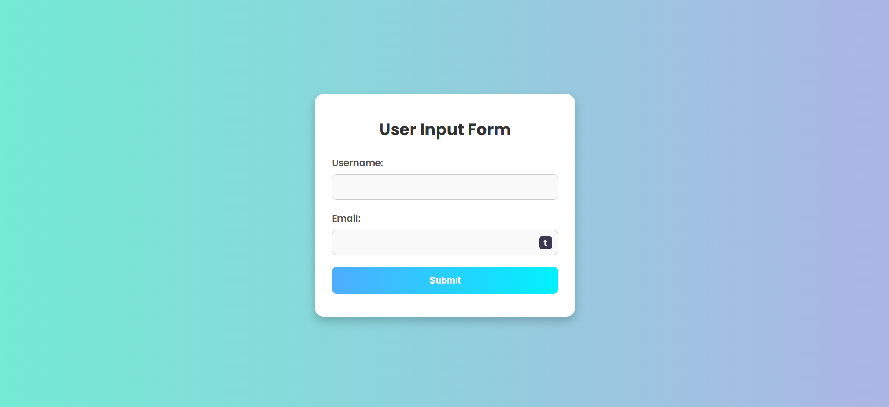
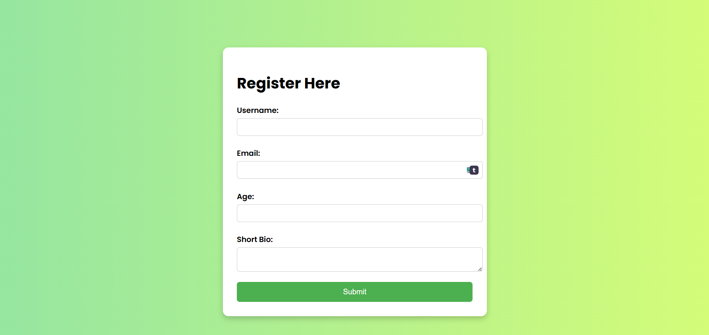
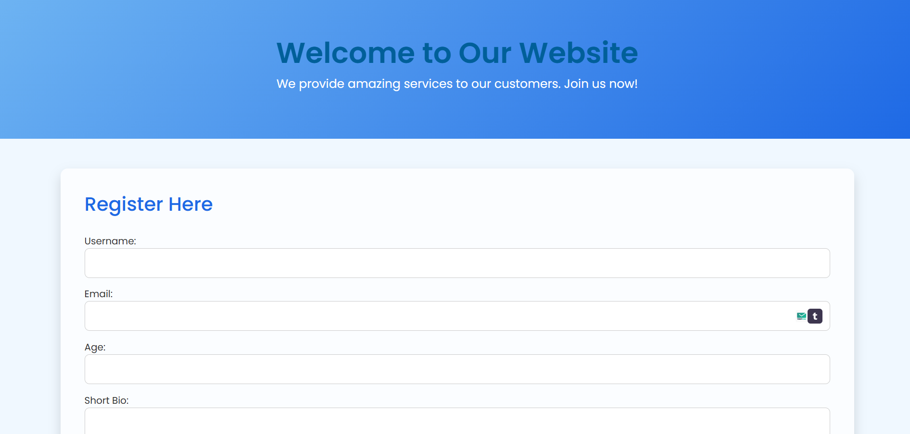
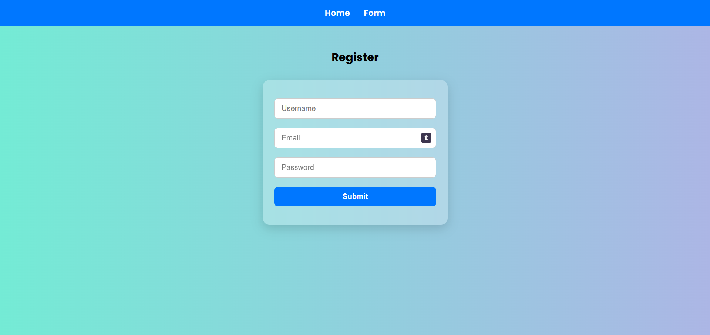
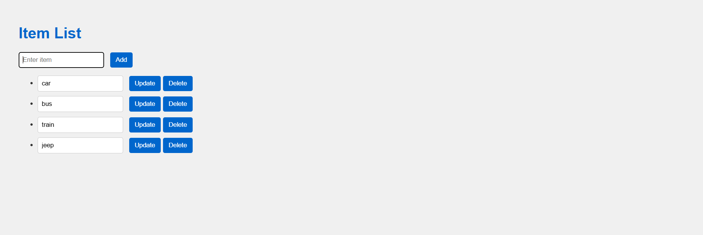

# 🔧 Cognifyz Task - Web Development Project

This repository contains the project/task completed as part of the Cognifyz internship program. The project demonstrates skills in **HTML, CSS, JavaScript, Node.js, and Express.js** to build a full-stack web application.

---

## 🚀 Project Overview

This project was developed as part of a web development task under the Cognifyz internship. It showcases a responsive front-end interface and a Node.js + Express.js powered backend. The application is designed to be clean, effective, and interactive, adhering to modern web development practices.

---

## 🛠️ Technologies Used

- HTML5
- CSS3, Bootstrap
- JavaScript (DOM, Events)
- Node.js
- Express.js
- EJS (for server-side rendering)

---

## 🔰 Level 1: Beginner

---

### 📌 Task 1: HTML Structure and Basic Server

#### 🎯 Objective:
Introduce the concept of **server-side rendering** and **basic form submissions**.

#### 📝 Description:
This task involves creating a simple HTML form and rendering it using **EJS** on a Node.js + Express server. It covers how to handle form submissions via POST requests, dynamically display data, and understand the flow between client-side and server-side communication.

#### 📸 Screenshot:

---

### 📌 Task 2: Inline Styles, Basic Interaction, and Server-Side Validation

#### 🎯 Objective:
Expand the use of **inline styles** and introduce **server-side validation** for form submissions.

#### 📝 Description:
Building upon Task 1, this task adds more interactive HTML forms and performs validation using **JavaScript** on the client side and **Express** middleware on the server side. It stores validated data in memory to simulate persistence and enhance reliability.

#### 📸 Screenshot:

---

## 🧩 Level 2: Intermediate

---

### 📌 Task 3: Advanced CSS Styling and Responsive Design

#### 🎯 Objective:
Enhance CSS styling and make the webpage fully responsive.

#### 📝 Description:
In this task, the layout is improved using **advanced CSS techniques** such as transitions and animations. A CSS framework like **Bootstrap** is used to maintain a clean, responsive interface that adjusts well across devices.

#### 📸 Screenshot:

---

### 📌 Task 4: Complex Form Validation and Dynamic DOM Manipulation

#### 🎯 Objective:
Extend **form validation** and implement **dynamic DOM updates** using JavaScript.

#### 📝 Description:
This task implements enhanced validation rules, such as password strength checks and pattern matching. It also introduces **DOM manipulation** to dynamically show/hide sections and display real-time feedback, improving the user experience. Client-side routing or simulated SPA behavior is also explored.

#### 📸 Screenshot:

---

## 🚀 Level 3: Advanced

---

### 📌 Task 5: API Integration and Front-End Interaction

#### 🎯 Objective:
Introduce **server-client communication** through a **RESTful API**.

#### 📝 Description:
This advanced task walks through creating custom **API endpoints** using Express to support CRUD operations. On the front end, `fetch()` or `axios` is used to call the API and render dynamic data on the web page. It bridges the gap between front-end and back-end interaction effectively.

#### 📸 Screenshot:

---

